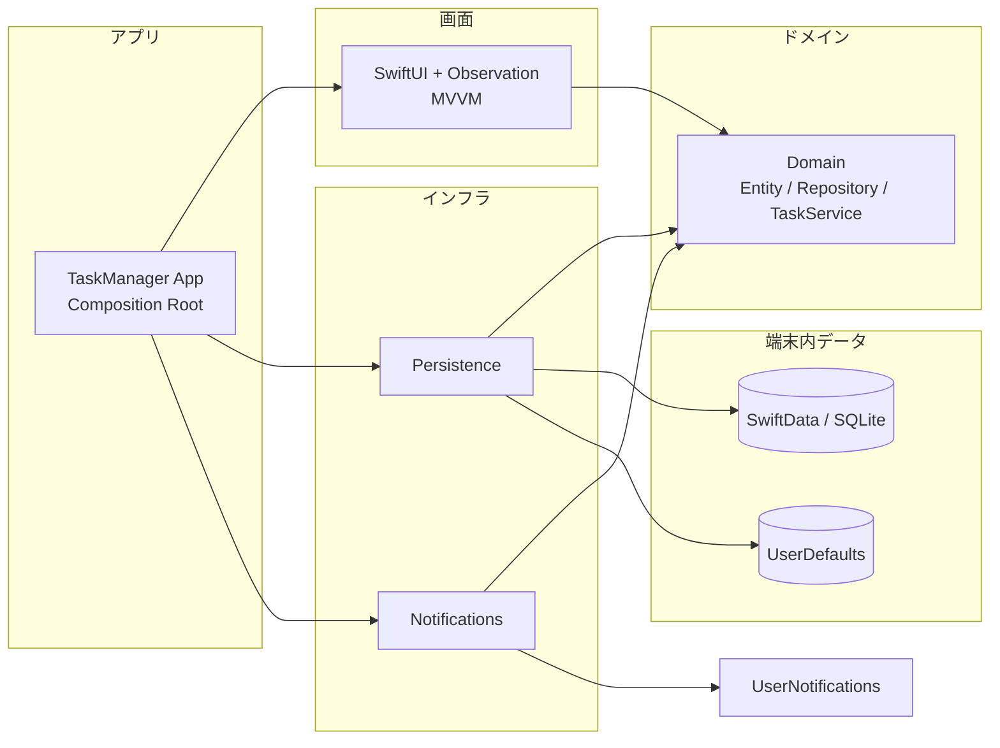
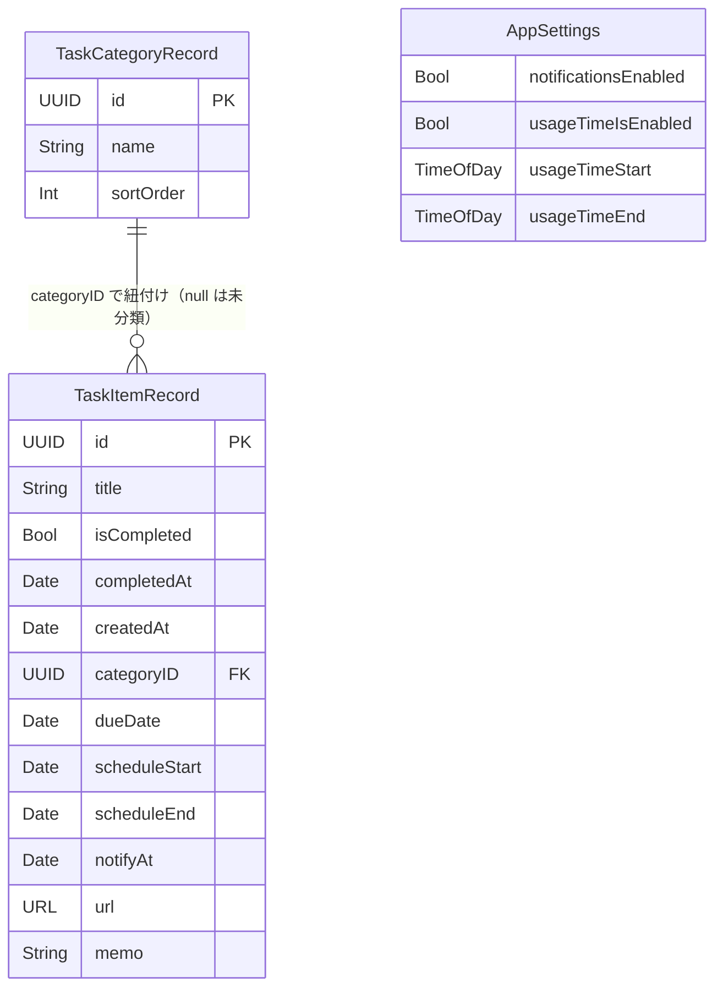

# TaskManager

**TaskManager** は、SwiftUI で作られた **iOS 向けのタスク管理アプリ**です。今日やるタスクをひと目で確認できるホーム画面と、カテゴリ・締切で整理できるタスク一覧に加え、決めた時間外はタスクから離れて休めるようにする「利用時間」の設定を備えています。

---

### 主要画面

- **ホーム**（今日実施するタスクを、時間帯で色が移り変わる部屋のイラストの上に表示）
- **タスク**（全タスクをカテゴリ別に確認・追加・並び替え。表示中の件数も見られる）
- **タスク編集**（締切・実施時間・通知・URL・メモを設定するシート。ホームとタスク画面から開く）
- **設定**（利用時間・通知設定・タスクデータ削除）
- **休憩画面**（利用時間外にアプリを開いたときに表示）

---

### プロジェクト工程

- **開発開始日**: 2026/10/5
- **開発終了日**: 未定

---

## 目的 & 開発背景

タスク管理アプリは「いつでもタスクを確認できる」ことが便利な反面、夜や休日にもついアプリを開いてしまい、頭が休まらないという問題があります。また、締切と「実際にいつ取り組むか」が混ざって管理されていると、今日何をすべきかが分かりにくくなりがちです。

TaskManager は、こうした課題を解決することを目的として開発したアプリケーションです。締切とは別に「実施時間」を持たせることで、ホーム画面では今日取り組むタスクだけに集中できるようにしています。さらに利用時間の設定により、決めた時間外にアプリを開くと休憩画面を挟み、「本当にタスクを確認しますか？」とひと呼吸おく動線を用意しました。完全に締め出すのではなく、本人の意思で確認できる余地を残すことで、無理なく休む習慣づくりを目指しています。

**本プロジェクトで実現すること**

- 今日取り組むタスクだけをホーム画面で確認できるようにする
- 締切までの残り日数を表示し、期限切れや締切間近（1 週間以内）のタスクを見落とさないようにする
- 利用時間の設定で、決めた時間外はタスクから離れて休めるようにする
- データを端末内だけに保存し、アカウント登録なしで使えるようにする
- 依存の向きをコンパイラで強制するモジュール構成で、保守しやすい設計にする

---


## ターゲット

- 学校課題や自主制作など、**複数のタスクを並行して抱える学生・個人**
- タスクのことが気になって、時間外にもアプリを開いてしまいがちな人
- iPhone（iOS 18 以降）ユーザー

---


## 機能（MVP）

- タブバーの「作成」からタスクを追加できる
- タスクに締切・実施時間・通知日時・URL・メモを設定できる
- カテゴリを追加・削除し、タブで絞り込める（削除したカテゴリのタスクは未分類に戻る）
- タスクを締切順・新しい順・古い順（作成日時）で並び替えられる（完了済みタスクは表示しない）
- 並び替えの「完了順」で、完了済みタスクだけを完了日時の新しい順に確認できる
- 実施日が今日のタスクをホーム画面に開始時刻順で表示する
- ホーム画面の背景と昼夜ゲージが、時刻に合わせて少しずつ色を変える
- 設定した日時にタスクの通知を受け取れる（アプリ全体の通知 ON/OFF も可能）
- 利用時間の設定で、アプリを使える時間帯（日をまたぐ時間帯にも対応）を決められる
- 外観をライト / ダーク / 自動（端末の設定に合わせる）から選べる
- すべてのタスクデータを削除できる（カテゴリと設定は残る）

---


## 技術スタック




- **言語・UI:** Swift 6（Strict Concurrency: complete）、SwiftUI、Observation
- **アーキテクチャ:** MVVM + Repository、ローカル Swift Package（`TaskManagerKit`）によるモジュール分割
- **データ保存:** SwiftData（タスク・カテゴリ）、UserDefaults（アプリ設定を JSON で保存）
- **通知:** UserNotifications（ローカル通知）
- **テスト:** Swift Testing（Unit テスト）、XCTest（UI テスト）
- **開発ツール:** XcodeGen（プロジェクト生成）、SwiftLint、swift-format、Makefile
- **対応 OS:** iOS 18.0 以降

---


## データ構造（SwiftData / UserDefaults）




- **TaskItemRecord / TaskCategoryRecord:** SwiftData に保存。Domain の値型（`TaskItem` / `TaskCategory`）と Repository 内で相互に変換し、`@Model` はモジュール外に公開しない。
- **カテゴリとタスク:** リレーションは張らず、タスク側の `categoryID` で紐付ける。
- **AppSettings:** 件数の少ない単純な値のため、UserDefaults の `appSettings` キーに JSON でまとめて保存する。

---


## プロジェクト構成

```
shownigth/
├── README.md
├── .gitignore
├── .swiftlint.yml                 # SwiftLint 設定
├── .swift-format                  # swift-format 設定
├── project.yml                    # XcodeGen 定義（.xcodeproj はここから生成し、git 管理しない）
├── Makefile                       # generate / open / lint / format / build / test / clean
├── TaskManager/                   # アプリターゲット（Composition Root）
│   ├── TaskManagerApp.swift       # エントリポイント・起動引数の解釈
│   ├── AppDependencies.swift      # 具体的な実装を組み立て、Domain のプロトコルとして画面に渡す
│   ├── RootView.swift             # タブで3画面を切り替え、時間外は休憩画面を重ねる
│   ├── TabBarLift.swift           # タブバーを少し持ち上げる
│   ├── TabBarItemHighlight.swift  # タスクタブ選択中の「作成」ボタンを青地に白文字で表示する
│   ├── KeyboardDismissOnTap.swift # 入力欄の外をタップしてキーボードを閉じる
│   ├── WindowAppearance.swift     # 外観（ライト / ダーク / 自動）をウィンドウ全体にゆっくり反映する
│   └── Resources/
│       └── Assets.xcassets/
│           ├── Contents.json
│           ├── AccentColor.colorset/
│           │   └── Contents.json
│           └── AppIcon.appiconset/
│               └── Contents.json
├── TaskManagerUITests/
│   └── TaskManagerUITests.swift   # UI テスト（XCTest）
└── Packages/
    └── TaskManagerKit/
        ├── Package.swift          # モジュール間の依存の向きを定義
        ├── Sources/
        │   ├── Domain/                                   # 保存方式や UI に依存しない中核
        │   │   ├── Entities/
        │   │   │   ├── TaskItem.swift                    # タスク（締切・実施時間・通知日時・URL・メモ）
        │   │   │   ├── TaskCategory.swift                # カテゴリ（タブの表示順とカテゴリカラーを持つ）
        │   │   │   ├── CategoryColor.swift               # 選べる 8 色のカテゴリカラー
        │   │   │   └── TaskSchedule.swift                # 実施する時間帯（開始・終了）
        │   │   ├── Notifications/
        │   │   │   └── TaskNotificationScheduler.swift   # 通知の登録・取り消しのプロトコル
        │   │   ├── Repositories/
        │   │   │   ├── TaskRepository.swift              # タスクの永続化のプロトコル
        │   │   │   ├── CategoryRepository.swift          # カテゴリの永続化のプロトコル
        │   │   │   └── SettingsRepository.swift          # アプリ設定の永続化のプロトコル
        │   │   ├── Services/
        │   │   │   └── TaskService.swift                 # タスクの保存と通知の同期をまとめる
        │   │   └── Settings/
        │   │       ├── AppSettings.swift                 # アプリ全体の設定（利用時間・通知・外観）
        │   │       ├── AppearanceMode.swift              # 外観の選び方（自動 / ライト / ダーク）
        │   │       ├── UsageTimeSettings.swift           # 利用時間と時間外の判定
        │   │       └── TimeOfDay.swift                   # 日付を持たない時刻（例: 8:00）
        │   ├── Persistence/                              # Domain の Repository の実装
        │   │   ├── Container/
        │   │   │   └── ModelContainerFactory.swift       # SwiftData のコンテナ生成
        │   │   ├── Records/
        │   │   │   ├── TaskItemRecord.swift              # TaskItem の SwiftData モデル
        │   │   │   └── TaskCategoryRecord.swift          # TaskCategory の SwiftData モデル
        │   │   ├── Repositories/
        │   │   │   ├── SwiftDataTaskRepository.swift     # SwiftData によるタスクの保存
        │   │   │   └── SwiftDataCategoryRepository.swift # SwiftData によるカテゴリの保存
        │   │   └── Settings/
        │   │       └── UserDefaultsSettingsRepository.swift  # UserDefaults に設定を JSON で保存
        │   ├── Notifications/                            # UserNotifications による通知の実装
        │   │   ├── UserNotificationScheduler.swift       # ローカル通知の登録・取り消し
        │   │   └── ForegroundNotificationPresenter.swift # アプリ使用中にも通知を表示する
        │   ├── HomeFeature/                              # ホーム画面
        │   │   ├── HomeView.swift
        │   │   ├── HomeViewModel.swift                   # 今日実施するタスクの抽出
        │   │   ├── HomeFormatter.swift                   # 日付・時刻の文言（英語表記）
        │   │   ├── DaylightClock.swift                   # 昼夜ゲージを動かす時計（実時間 / デモ用の早送り）
        │   │   ├── DaylightCycle.swift                   # 時刻から空の状態と太陽の位置を決める
        │   │   ├── RoomTint.swift                        # 時刻から部屋の色味を決める
        │   │   ├── CeilingBeamAlignment.swift            # 天井の梁を日付の行の高さに揃える拡大率
        │   │   ├── Components/
        │   │   │   ├── DateHeader.swift                  # 日付と昼夜ゲージ
        │   │   │   ├── DaylightGauge.swift               # 空の色に染まる昼夜ゲージ
        │   │   │   ├── SkyDecoration.swift               # ゲージ背景の雲と星
        │   │   │   ├── RoomBackground.swift              # 部屋のイラストに光・影・明かりを重ねる背景
        │   │   │   └── TodayTaskCard.swift               # 今日のタスクを時間付きで並べるカード
        │   │   └── Resources/
        │   │       └── Media.xcassets/
        │   │           ├── Contents.json
        │   │           └── HomeBackground.imageset/
        │   │               ├── Contents.json
        │   │               └── home_background.png       # 部屋のイラスト
        │   ├── TaskListFeature/                          # タスク画面
        │   │   ├── TaskListView.swift
        │   │   ├── TaskListViewModel.swift               # 絞り込み・並び替え・件数
        │   │   ├── TaskListFormatter.swift               # 締切・残り日数の文言
        │   │   ├── CategoryColor+Color.swift             # カテゴリカラーの表示色と読み上げ名
        │   │   └── Components/
        │   │       ├── CategoryEditorSheet.swift         # カテゴリの名前とカテゴリカラーを決めるシート
        │   │       ├── CategoryTabBar.swift              # 「全て」とカテゴリのガラスのタブ（最大 2 段、あふれたら横スクロール）
        │   │       ├── TwoRowBadgeLayout.swift           # バッジを最大 2 段に振り分けるレイアウト
        │   │       ├── TaskListHeader.swift              # 共通の見出しに件数・並び替えボタンを載せる
        │   │       └── TaskRow.swift                     # タスク画面の1行
        │   ├── TaskEditorFeature/                        # タスク追加・編集シート（ホームとタスク画面で共有）
        │   │   ├── TaskEditorView.swift
        │   │   └── TaskEditorViewModel.swift
        │   ├── SettingsFeature/                          # 設定画面
        │   │   ├── SettingsView.swift
        │   │   ├── SettingsViewModel.swift               # 利用時間・通知・外観・データ削除
        │   │   ├── AppearanceMode+UI.swift               # 外観の選択肢の名前
        │   │   └── Components/
        │   │       ├── SettingsCard.swift                # ガラスのカード・行・区切り線・項目名
        │   │       ├── SettingsIcon.swift                # 設定アプリ風の色付きアイコン
        │   │       └── SettingsDescription.swift         # カード内に置く説明文の行
        │   ├── DesignSystem/                             # 画面をまたいで使う見た目の部品
        │   │   ├── GlassBackground.swift                 # リキッドグラスの背景と影
        │   │   ├── ScreenHeader.swift                    # タブの画面で揃える見出し（画面名・補足・右の操作）
        │   │   ├── ScreenBackground.swift                # タブの画面で揃える淡いグラデーションの背景
        │   │   └── AppSheet.swift                        # 大きさを揃えたボトムシート
        │   ├── UsageTimeFeature/                         # 休憩画面
        │   │   ├── RestView.swift                        # 「今は休む時間です」画面
        │   │   └── UsageTimeViewModel.swift              # 休憩画面を出すかどうかの判定
        │   └── DomainTestSupport/                        # テスト専用のモック（products に含めない）
        │       ├── MockTaskRepository.swift
        │       ├── MockCategoryRepository.swift
        │       ├── MockNotificationScheduler.swift
        │       ├── InMemorySettingsRepository.swift
        │       ├── TaskServiceFixture.swift              # モック一式で組み立てた TaskService
        │       └── TestCalendar.swift                    # タイムゾーンに左右されないテスト用カレンダー
        └── Tests/                                        # Unit テスト（Swift Testing）
            ├── DomainTests/
            │   ├── TaskItemTests.swift
            │   ├── TaskServiceTests.swift
            │   └── UsageTimeSettingsTests.swift
            ├── PersistenceTests/
            │   ├── SwiftDataTaskRepositoryTests.swift
            │   ├── SwiftDataCategoryRepositoryTests.swift
            │   └── UserDefaultsSettingsRepositoryTests.swift
            ├── HomeFeatureTests/
            │   ├── HomeViewModelTests.swift
            │   ├── HomeFormatterTests.swift
            │   ├── DaylightClockTests.swift
            │   ├── DaylightCycleTests.swift
            │   └── RoomTintCycleTests.swift
            ├── TaskListFeatureTests/
            │   └── TaskListViewModelTests.swift
            ├── TaskEditorFeatureTests/
            │   └── TaskEditorViewModelTests.swift
            ├── SettingsFeatureTests/
            │   └── SettingsViewModelTests.swift
            └── UsageTimeFeatureTests/
                └── UsageTimeViewModelTests.swift
```

- **生成物:** `TaskManager.xcodeproj`（`make generate` で生成）、`build/`、`.build/`、`.swiftpm/` などのビルド成果物・個人設定は git 管理外のため記載していない。

- **ルート:** XcodeGen・Lint・フォーマットの設定。`make open` でプロジェクトを生成して Xcode で開く。`make test` でシミュレータ上のテストを実行（`SIMULATOR="iPhone 16"` で端末を変更可能）。
- **TaskManager:** 依存関係の組み立てだけを担う。UI テスト時（`-UITesting`）はメモリ上の保存先を使い、端末のデータに触れない。`-DaylightDemo` を付けて起動するとホームの昼夜ゲージが 30 秒で 1 日分進む。
- **Packages/TaskManagerKit:** 依存の向きを `Feature -> Domain <- Persistence / Notifications` に限定し、Feature から Persistence や Notifications を参照できないことをターゲットの依存定義でコンパイラに強制させる。複数の画面で使う `TaskEditorFeature` だけは Feature 同士の依存を許す。見た目の部品をまとめた `DesignSystem` はどこにも依存せず、必要な Feature だけが参照する。


## commitメッセージ

- feat：新機能追加
- fix：バグ修正
- hotfix：クリティカルなバグ修正
- add：新規（ファイル）機能追加
- update：機能修正（バグではない）
- change：仕様変更
- clean：整理（リファクタリング等）
- disable：無効化（コメントアウト等）
- remove：削除（ファイル）
- upgrade：バージョンアップ
- revert：変更取り消し
- docs：ドキュメント修正（README、コメント等）
- style：コードフォーマット修正（インデント、スペース等）
- perf：パフォーマンス改善
- test：テストコード追加・修正
- ci：CI/CD 設定変更（GitHub Actions 等）
- build：ビルド関連変更（依存関係、ビルドツール設定等）
- chore：雑務的変更（ユーザーに直接影響なし）

